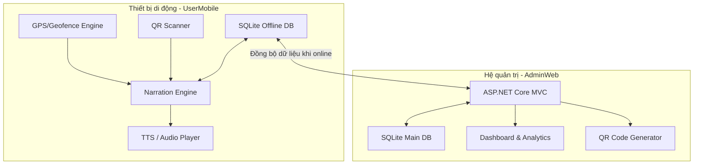

# VERSA - Hệ Thống Thuyết Minh Du Lịch Tự Động Theo Vị Trí (Location-Based Tour Guide System)

VERSA là hệ thống thuyết minh du lịch tự động, thông minh dựa trên vị trí địa lý thực tế (GPS Tracking) và mã phản hồi nhanh (QR Code). Hệ thống được thiết kế để mang lại trải nghiệm tham quan sinh động, không chạm cho du khách, đồng thời cung cấp công cụ quản lý dữ liệu di sản và phân tích hành vi người dùng mạnh mẽ cho nhà quản trị.

Dự án bao gồm hai thành phần chính:
1. **UserMobile**: Ứng dụng di động đa nền tảng (Android/iOS) phát triển trên nền .NET MAUI dành cho du khách du lịch thực địa.
2. **AdminWeb**: Hệ thống quản trị nội dung (CMS) và điều hành phát triển trên ASP.NET Core MVC dành cho Admin/Nhân viên quản lý địa điểm, tour, và phân tích số liệu.

---

## Mục lục
- [1. Kiến trúc hệ thống](#1-kiến-trúc-hệ-thống)
- [2. Tính năng nổi bật](#2-tính-năng-nổi-bật)
- [3. Luồng hoạt động mẫu](#3-luồng-hoạt-động-mẫu)
- [4. Công nghệ & Thư viện sử dụng](#4-công-nghệ--thư-viện-sử-dụng)
- [5. Cấu trúc thư mục dự án](#5-cấu-trúc-thư-mục-dự-án)
- [6. Yêu cầu môi trường & Cài đặt nhanh](#6-yêu-cầu-môi-trường--cài-đặt-nhanh)
  - [Cài đặt Môi trường](#cài-đặt-môi-trường)
  - [Hướng dẫn khởi chạy AdminWeb](#hướng-dẫn-khởi-chạy-adminweb)
  - [Hướng dẫn khởi chạy UserMobile](#hướng-dẫn-khởi-chạy-usermobile)

---

## 1. Kiến trúc hệ thống

Hệ thống VERSA được thiết kế theo mô hình Client-Server với khả năng hoạt động offline linh hoạt.



*   **Location + Geofencing**: Theo dõi GPS liên tục và tạo "điểm quan tâm" (POI - Point of Interest) với bán kính tương ứng (geofence).
*   **Geofence Engine**: Xác định vị trí người dùng, tính toán khoảng cách bằng công thức Haversine để kích hoạt POI gần nhất/ưu tiên cao nhất khi đi vào vùng.
*   **Narration Engine**: Quản lý hàng đợi âm thanh, lựa chọn giọng đọc TTS hoặc phát file audio ghi âm sẵn, cơ chế debounce/cooldown tránh lặp nội dung gây khó chịu cho khách du lịch.
*   **Content Layer**: Lưu trữ dữ liệu POI offline trong SQLite của điện thoại và tự động đồng bộ từ Server khi có kết nối Internet.

---

## 2. Tính năng nổi bật

### 📱 Ứng dụng Di động (UserMobile)
*   **GPS Tracking thời gian thực**:
    *   Tích hợp ngầm (Background Service) và nổi (Foreground Service) trên Android/iOS giúp theo dõi vị trí ổn định.
    *   Thuật toán tối ưu hóa pin và độ chính xác của GPS.
*   **Geofence & Định vị POI**:
    *   Tự động xác định điểm tham quan gần nhất trong bán kính kích hoạt thiết lập sẵn.
    *   Điều phối thứ tự phát thuyết minh theo độ ưu tiên của POI.
*   **Audio Narration & TTS**:
    *   Phát file audio gốc (MP3) hoặc chuyển đổi nội dung văn bản thành giọng nói (Text To Speech) bằng giọng đọc bản địa chất lượng cao.
    *   Hàng đợi điều khiển thông minh và khoảng nghỉ (cooldown) tránh chống spam âm thanh.
*   **Map View trực quan**:
    *   Hiển thị bản đồ với vị trí của người dùng và các POI lân cận.
    *   Highlight điểm POI đang được thuyết minh.
*   **Quét QR Code nhanh**:
    *   Quét mã QR dán tại các điểm dừng xe buýt, các phường (Khánh Hội, Vĩnh Hội, Xóm Chiếu) để nghe thuyết minh ngay lập tức mà không cần bật định vị GPS.
*   **Chế độ Ngoại tuyến (Offline Mode)**:
    *   Lưu trữ dữ liệu điểm POI và tải trước tài nguyên âm thanh để du khách thoải mái sử dụng khi mất kết nối mạng.

### 💻 Trang Quản trị (AdminWeb CMS)
*   **Dashboard & Analytics**:
    *   Thống kê trực quan số lượng POI, Audio, Tour và tổng lượt sử dụng.
    *   Báo cáo các POI được nghe nhiều nhất, thời gian nghe trung bình, và heatmap phân bổ vị trí người dùng ẩn danh phục vụ công tác nâng cao chất lượng du lịch.
*   **Quản lý Điểm thuyết minh (POI)**:
    *   Tạo mới, cập nhật tọa độ (Lat/Lng), cài đặt bán kính geofence kích hoạt và độ ưu tiên.
    *   Đính kèm mô tả văn bản, ảnh minh họa, link bản đồ, và bản dịch đa ngôn ngữ.
*   **Quản lý Tài nguyên Âm thanh**:
    *   Tải lên file âm thanh MP3, nghe thử trực tiếp trên trình duyệt.
*   **Quản lý Tour & Lộ trình**:
    *   Thiết kế các tour tham quan theo chuỗi nhiều POI và sắp xếp thứ tự di chuyển gợi ý.
*   **Sinh và Quản lý QR Code**:
    *   Tự động tạo mã QR Code cho từng POI/Tour và cho phép tải về để in ấn thực tế.
*   **Phân quyền & Bảo mật**:
    *   Đăng nhập quản trị viên, phân chia vai trò truy cập sử dụng ASP.NET Core Identity.

---

## 3. Luồng hoạt động mẫu

1.  **Chuẩn bị**: Trình quản lý (Admin CMS) cấu hình các điểm POI trên bản đồ (vị trí, bán kính, ưu tiên, nội dung, bản dịch, audio). Du khách tải ứng dụng Mobile và đồng bộ dữ liệu.
2.  **Tracking & Kích hoạt**:
    *   Khi du khách di chuyển ngoài thực địa, Service chạy ngầm cập nhật GPS.
    *   **Geofence Engine** so khớp tọa độ và xác định xem du khách có lọt vào bán kính của POI nào không.
3.  **Phát thuyết minh**:
    *   **Narration Engine** kiểm tra xem POI đó đã được phát trước đó chưa (trong vòng X phút).
    *   Nếu đủ điều kiện, ứng dụng sẽ thực hiện phát Audio (nếu có file MP3) hoặc gọi API TTS để đọc thuyết minh.
    *   Tránh trùng lặp và ghi log lịch sử phát ẩn danh.
4.  **Phân tích**: Lịch sử nghe và tuyến đường ẩn danh được gửi về máy chủ khi có mạng để phân tích hành vi và vẽ heatmap lượng khách trên Admin CMS.

---

## 4. Công nghệ & Thư viện sử dụng

### AdminWeb
*   **Framework chính**: ASP.NET Core MVC (.NET 10), Razor View
*   **Cơ sở dữ liệu & ORM**: SQLite, Entity Framework Core (EF Core)
*   **Xác thực**: ASP.NET Core Identity
*   **Giao diện**: Bootstrap 5, LeafletJS (Bản đồ OpenStreetMap)
*   **Thư viện sinh QR**: QRCoder

### UserMobile
*   **Framework chính**: .NET MAUI (.NET 10)
*   **Mô hình thiết kế**: MVVM, XAML
*   **Định vị & Maps**: MAUI Geolocation API, Android FusedLocationProvider / iOS CLLocationManager, Microsoft.Maui.Controls.Maps
*   **Âm thanh & TTS**: Plugin.Maui.Audio, API Text To Speech tích hợp
*   **Quét QR**: ZXing.Net.Maui
*   **Cơ sở dữ liệu**: SQLite (sqlite-net-pcl)

---

## 5. Cấu trúc thư mục dự án

```text
TourGuideSystem/
│
├── AdminWeb/             # Dự án CMS quản trị (ASP.NET Core MVC)
│   ├── Controllers/      # Bộ điều hướng nghiệp vụ CMS
│   ├── Models/           # Định nghĩa Entities và ViewModels (EF Core)
│   ├── Views/            # Giao diện người dùng sử dụng Razor View
│   ├── wwwroot/          # Tài nguyên tĩnh (CSS, JS, Image, LeafletJS,...)
│   └── AdminWeb.csproj   # File cấu hình project .NET
│
├── UserMobile/           # Ứng dụng di động du khách (.NET MAUI)
│   ├── Platforms/        # Code bổ trợ chạy nền chuyên biệt (Android/iOS)
│   ├── Resources/        # Ảnh, Font chữ, Raw Audio và String đa ngôn ngữ
│   ├── App.xaml          # Tài nguyên khởi chạy ứng dụng
│   ├── MauiProgram.cs    # Đăng ký Service, Dependency Injection, Plugin
│   └── UserMobile.csproj # File cấu hình project MAUI
│
├── backend/              # Thư mục chứa các thành phần API chung (nếu có)
│
├── Yêu cầu dự án.txt     # Tài liệu mô tả yêu cầu nghiệp vụ ban đầu
└── README.md             # Tài liệu hướng dẫn tổng quan dự án (File này)
```

---

## 6. Yêu cầu môi trường & Cài đặt nhanh

### Cài đặt Môi trường

1.  **Cài đặt .NET 10 SDK**:
    *   Kiểm tra phiên bản bằng lệnh: `dotnet --version`
    *   Nếu chưa cài đặt, tải phiên bản mới nhất tại: [.NET Download](https://dotnet.microsoft.com/download)
2.  **Cài đặt .NET MAUI Workload** (dành cho phát triển UserMobile):
    *   Cài đặt workload MAUI thông qua CLI:
        ```bash
        dotnet workload install maui
        ```
    *   Kiểm tra danh sách workload đang có: `dotnet workload list`
3.  **Công cụ lập trình (IDE)**:
    *   Nên sử dụng **Visual Studio 2022** (hỗ trợ tốt nhất cho MAUI) hoặc **Visual Studio Code** kèm các Extension: `C# Dev Kit`, `C#`, `NuGet Gallery`.

---

### Hướng dẫn khởi chạy AdminWeb

1.  Di chuyển vào thư mục dự án quản trị:
    ```bash
    cd AdminWeb
    ```
2.  Khôi phục các thư viện NuGet phụ thuộc:
    ```bash
    dotnet restore
    ```
3.  Chạy ứng dụng:
    ```bash
    dotnet run
    ```
4.  Mở trình duyệt và truy cập theo đường dẫn Localhost hiển thị trên Console (ví dụ: `http://localhost:5000` hoặc `https://localhost:5001`).

---

### Hướng dẫn khởi chạy UserMobile

1.  Di chuyển vào thư mục di động:
    ```bash
    cd UserMobile
    ```
2.  Khôi phục các thư viện NuGet phụ thuộc:
    ```bash
    dotnet restore
    ```
3.  Kết nối thiết bị di động thật (đã bật Developer Mode & USB Debugging) hoặc khởi động Emulator/Simulator.
4.  Khởi chạy ứng dụng:
    *   **Dành cho Android**:
        ```bash
        dotnet build -t:Run -f net10.0-android
        ```
    *   **Dành cho iOS** (yêu cầu chạy trên macOS):
        ```bash
        dotnet build -t:Run -f net10.0-ios
        ```