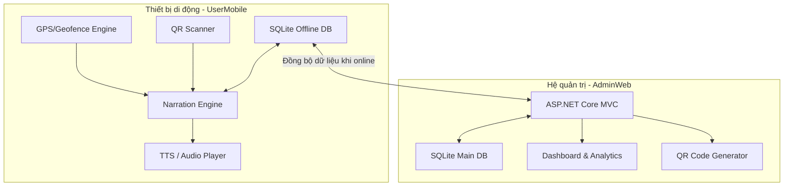

# VERSA - Hệ Thống Thuyết Minh Du Lịch Tự Động Theo Vị Trí (Location-Based Tour Guide System)

VERSA là hệ thống thuyết minh du lịch tự động, thông minh dựa trên vị trí địa lý thực tế (GPS Tracking) và mã phản hồi nhanh (QR Code). Hệ thống được thiết kế để mang lại trải nghiệm tham quan sinh động, không chạm cho du khách, đồng thời cung cấp công cụ quản lý dữ liệu di sản và phân tích hành vi người dùng mạnh mẽ cho nhà quản trị.

Dự án bao gồm hai thành phần chính:

1. **UserMobile**: Ứng dụng di động đa nền tảng (Android/iOS) phát triển trên nền .NET MAUI dành cho du khách du lịch thực địa.
2. **AdminWeb**: Hệ thống quản trị nội dung (CMS) và điều hành phát triển trên ASP.NET Core MVC dành cho Admin/Nhân viên quản lý địa điểm, tour, và phân tích số liệu.

---

## Mục lục

- [1. Kiến trúc hệ thống](#1-kiến-trúc-hệ-thống)
- [2. Tính năng nổi bật](#2-tính-năng-nổi-bật)
- [3. Luồng hoạt động mẫu](#3-luồng-hoạt-động-mẫu)
- [4. Công nghệ & Thư viện sử dụng](#4-công-nghệ--thư-viện-sử-dụng)
- [5. Cấu trúc thư mục dự án](#5-cấu-trúc-thư-mục-dự-án)
- [6. Yêu cầu môi trường & Cài đặt nhanh](#6-yêu-cầu-môi-trường--cài-đặt-nhanh)
  - [Cài đặt Môi trường](#cài-đặt-môi-trường)
  - [Hướng dẫn khởi chạy AdminWeb](#hướng-dẫn-khởi-chạy-adminweb)
  - [Hướng dẫn khởi chạy UserMobile](#hướng-dẫn-khởi-chạy-usermobile)

---

## 1. Kiến trúc hệ thống

Hệ thống VERSA được thiết kế theo mô hình Client-Server với khả năng hoạt động offline linh hoạt.



- **Location + Geofencing**: Theo dõi GPS liên tục và tạo "điểm quan tâm" (POI - Point of Interest) với bán kính tương ứng (geofence).
- **Geofence Engine**: Xác định vị trí người dùng, tính toán khoảng cách bằng công thức Haversine để kích hoạt POI gần nhất/ưu tiên cao nhất khi đi vào vùng.
- **Narration Engine**: Quản lý hàng đợi âm thanh, lựa chọn giọng đọc TTS hoặc phát file audio ghi âm sẵn, cơ chế debounce/cooldown tránh lặp nội dung gây khó chịu cho khách du lịch.
- **Content Layer**: Lưu trữ dữ liệu POI offline trong SQLite của điện thoại và tự động đồng bộ từ Server khi có kết nối Internet.

---

## 2. Tính năng nổi bật

### 📱 Ứng dụng Di động (UserMobile)

- **GPS Tracking thời gian thực**:
  - Tích hợp ngầm (Background Service) và nổi (Foreground Service) trên Android/iOS giúp theo dõi vị trí ổn định.
  - Thuật toán tối ưu hóa pin và độ chính xác của GPS.
- **Geofence & Định vị POI**:
  - Tự động xác định điểm tham quan gần nhất trong bán kính kích hoạt thiết lập sẵn.
    # VERSA — Hệ thống thuyết minh du lịch theo vị trí

  Phiên bản rút gọn và hướng dẫn chi tiết để cài, chạy và triển khai hai thành phần chính của dự án:
  - `UserMobile` — ứng dụng di động đa nền tảng (.NET MAUI)
  - `AdminWeb` — trang quản trị (ASP.NET Core MVC)

  Nội dung README này tập trung vào:
  - Tổng quan kiến trúc
  - Yêu cầu môi trường chi tiết
  - Các lệnh sẵn sàng copy để chạy trên máy mới
  - Tùy chọn chạy nhanh bằng SQLite (không cần SQL Server)

  Xem thêm file cài đặt nhanh: [SETUP.md](SETUP.md)

  ## Mục lục
  - **Kiến trúc**
  - **Yêu cầu môi trường**
  - **Cài & chạy AdminWeb** (SQL Server / SQLite)
  - **Cài & chạy UserMobile (.NET MAUI)**
  - **Cấu trúc dự án**
  - **Khắc phục lỗi thường gặp**

  ***

  ## Kiến trúc (tóm tắt)
  - Client: `UserMobile` — theo dõi GPS, geofence, phát audio/TTS, lưu trữ offline (SQLite).
  - Server: `AdminWeb` — CMS quản lý POI, Audio, Tour; cung cấp API và giao diện quản trị.

  Hai thành phần đồng bộ dữ liệu khi có kết nối để đảm bảo hoạt động offline cho ứng dụng di động.

  ***

  ## Yêu cầu môi trường
  - .NET SDK 10 (kiểm tra: `dotnet --version`)
  - (MAUI) MAUI workload: `dotnet workload install maui`
  - (Android) Android SDK + platform-tools và `adb` trên PATH (kiểm tra: `adb version`)
  - IDE khuyến nghị: Visual Studio 2022 (Windows) với workloads MAUI, hoặc VS Code với extensions C# nếu dùng CLI.

  ***

  ## Cài & chạy `AdminWeb`

  Lưu ý: mã nguồn hiện mặc định cấu hình kết nối tới SQL Server trong `AdminWeb/appsettings.json`. Có hai cách chạy trên máy mới:
  1. Giữ SQL Server (Windows)

  ```bash
  cd AdminWeb
  dotnet restore
  dotnet tool install --global dotnet-ef    # nếu cần chạy migrations
  dotnet ef database update                 # áp dụng migration nếu có
  dotnet run
  ```

  2. (Khuyến nghị cho máy thử nghiệm) Chuyển sang SQLite (không cần SQL Server)
  - Trong `AdminWeb/appsettings.json`, thay `DefaultConnection` bằng:

  ```json
  "ConnectionStrings": {
    "DefaultConnection": "Data Source=versa.db"
  }
  ```

  Sau đó chạy:

  ```bash
  cd AdminWeb
  dotnet restore
  dotnet tool install --global dotnet-ef
  # (nếu chưa có migrations) dotnet ef migrations add InitSqlite
  dotnet ef database update
  dotnet run
  ```

  Ứng dụng sẽ tạo file `versa.db` trong thư mục `AdminWeb`.

  Ghi chú: tôi đã cập nhật `AdminWeb/Program.cs` để tự chọn `UseSqlite(...)` khi `DefaultConnection` chứa `Data Source=`; nếu chuỗi kết nối không có, sẽ dùng SQL Server.

  ***

  ## Cài & chạy `UserMobile` (.NET MAUI)

  ```bash
  dotnet workload install maui   # lần đầu trên máy mới
  cd UserMobile
  dotnet restore
  # Android (device/emulator)
  dotnet build -t:Run -f net10.0-android
  # Windows (nếu muốn chạy target Windows)
  dotnet build -t:Run -f net10.0-windows10.0.19041.0
  ```

  Đảm bảo thiết bị/emulator Android đã sẵn sàng (`adb devices`). Với iOS bạn cần macOS + Xcode.

  ***

  ## Cấu trúc dự án (tóm tắt)

  ```
  TourGuideSystem/
  ├── AdminWeb/        # ASP.NET Core MVC (CMS)
  ├── UserMobile/      # .NET MAUI mobile app
  ├── SETUP.md         # Hướng dẫn cài đặt nhanh (mới thêm)
  └── README.md        # (file này)
  ```

  ***

  ## Khắc phục lỗi thường gặp
  - Lỗi EF provider: chạy `dotnet restore` và kiểm tra `AdminWeb/AdminWeb.csproj` có `Microsoft.EntityFrameworkCore.Sqlite` nếu dùng SQLite.
  - `dotnet ef` không tìm thấy: cài tool `dotnet tool install --global dotnet-ef` và đảm bảo thư mục global tools trong PATH.
  - Lỗi MAUI build: ưu tiên Visual Studio 2022 với workloads MAUI; kiểm tra `dotnet workload list`.

  ***

  Nếu bạn muốn, tôi có thể:
  - Tự động cập nhật `AdminWeb/appsettings.json` để mặc định dùng SQLite (`Data Source=versa.db`).
  - Thêm script `init-db` (migrations) và một file `deploy/README-deploy.md` chứa checklist triển khai.

  Yêu cầu tiếp theo?
