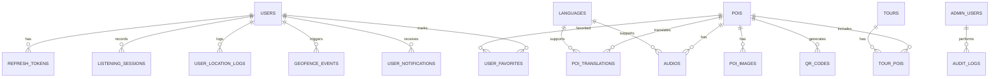

# VERSA Web API - Backend Service

Hệ thống Web API dịch vụ phục vụ cho ứng dụng di động du khách (**UserMobile**) và đóng vai trò kết nối, xử lý nghiệp vụ trung tâm cho hệ thống **Thuyết Minh Du Lịch Tự Động Theo Vị Trí (VERSA)**. 

Dự án được xây dựng dựa trên nền tảng **ASP.NET Core Web API** phiên bản mới nhất, kết nối cơ sở dữ liệu **PostgreSQL** nhằm đáp ứng khả năng lưu trữ logs định vị thời gian thực lớn, truy vấn tọa độ địa lý tối ưu và xác thực bảo mật cao.

---

## Mục lục

- [1. Giới thiệu tổng quan](#1-giới-thiệu-tổng-quan)
- [2. Công nghệ & Thư viện sử dụng](#2-công-nghệ--thư-viện-sử-dụng)
- [3. Cấu trúc thư mục dự án](#3-cấu-trúc-thư-mục-dự-án)
- [4. Cơ sở dữ liệu (Database Schema & PostgreSQL)](#4-cơ-sở-dữ-liệu-database-schema--postgresql)
- [5. Hướng dẫn thiết lập & Chạy thử](#5-hướng-dẫn-thiết-lập--chạy-thử)
- [6. Tài liệu & Kiểm thử API](#6-tài-liệu--kiểm-thử-api)
- [7. Thiết kế API Endpoints (API Specification)](#7-thiết-kế-api-endpoints-api-specification)
- [8. Cơ chế đồng bộ hóa ngoại tuyến (Offline Sync Flow)](#8-cơ-chế-đồng-bộ-hóa-ngoại-tuyến-offline-sync-flow)

---

## 1. Giới thiệu tổng quan

Hệ thống backend cung cấp các API RESTful giúp:
*   **Xác thực và phân quyền**: Quản lý tài khoản du khách (đăng ký, đăng nhập JWT, quản lý refresh token).
*   **Cung cấp dữ liệu điểm tham quan (POIs)**: Trả về thông tin POIs, tệp tin âm thanh thuyết minh (Audio MP3) và nội dung văn bản đa ngôn ngữ (Tiếng Việt, Anh, Trung, Nhật, Hàn).
*   **Quản lý Tour**: Cung cấp danh sách các chặng đi (Tour) và danh sách điểm dừng được sắp xếp tối ưu.
*   **Ghi nhận dữ liệu thực địa**: Thu thập logs vị trí GPS của người dùng (`user_location_logs`), sự kiện đi vào/ra vùng định vị geofence (`geofence_events`), và phiên nghe thuyết minh (`listening_sessions`) để phân tích heatmap.
*   **Hỗ trợ Offline-first**: Trả về dấu thời gian cập nhật để ứng dụng di động đồng bộ delta tải dữ liệu ngoại tuyến hiệu quả.

---

## 2. Công nghệ & Thư viện sử dụng

*   **Framework chính**: ASP.NET Core Web API (.NET 10.0)
*   **Hệ quản trị cơ sở dữ liệu**: PostgreSQL 16+ (Hỗ trợ mở rộng không gian, xử lý định dạng JSONB cho log hệ thống và định dạng UUIDv7)
*   **Thư viện ORM**: Entity Framework Core 10.0 (EF Core)
*   **Provider PostgreSQL**: `Npgsql.EntityFrameworkCore.PostgreSQL`
*   **Bảo mật & Identity**: ASP.NET Core Identity & JWT (JSON Web Token)
*   **Tài liệu API**: OpenAPI / Swagger (`Microsoft.AspNetCore.OpenApi`)

---

## 3. Cấu trúc thư mục dự án

```text
backend/
├── Properties/
│   └── launchSettings.json          # Cấu hình cổng chạy ứng dụng (Http: 5105, Https: 7299)
├── bin/                             # Thư mục build binary
├── obj/                             # Thư mục build object tạm
├── appsettings.json                 # Cấu hình chính (Connection Strings, JWT, Logging...)
├── appsettings.Development.json     # Cấu hình riêng cho môi trường Phát triển
├── backend.csproj                   # File cấu hình project và các NuGet packages
├── backend.http                     # File script test API nhanh trong VS Code
└── Program.cs                       # Entry point, cấu hình Middleware và Dependency Injection
```

Các thư mục cần triển khai khi phát triển thêm:
*   `/Controllers`: Chứa các API controller quản lý request/response.
*   `/Data`: Chứa `ApplicationDbContext` cấu hình các bảng, quan hệ Fluent API và Seed Data.
*   `/Models`: Định nghĩa các thực thể (Entities) tương ứng bảng PostgreSQL.
*   `/DTOs`: Các Data Transfer Objects để truyền tải dữ liệu đầu vào/ra của API.
*   `/Services`: Lớp xử lý logic nghiệp vụ (Auth Service, POI Service, Sync Service...).

---

## 4. Cơ sở dữ liệu (Database Schema & PostgreSQL)

Cơ sở dữ liệu của dự án sử dụng hệ quản trị **PostgreSQL**. Khoá chính của các bảng hệ thống sử dụng định dạng **UUIDv7** để hỗ trợ sắp xếp theo thời gian tốt hơn UUIDv4 và tránh xung đột khi đồng bộ ngoại tuyến.

Sơ đồ liên kết chính giữa các thực thể:


### Các bảng dữ liệu chính trong `database.sql`:
1.  `languages`: Danh sách ngôn ngữ (vi, en, zh, ja, ko).
2.  `users`: Thông tin tài khoản người dùng di động và ngôn ngữ ưu tiên.
3.  `refresh_tokens`: Tokens duy trì phiên đăng nhập cho di động.
4.  `roles` & `admin_users`: Quản trị viên CMS.
5.  `pois`: Điểm thuyết minh gồm tọa độ `latitude`, `longitude`, bán kính kích hoạt `trigger_radius` và độ ưu tiên `priority`.
6.  `poi_translations`: Mô tả POI chi tiết tương ứng từng ngôn ngữ.
7.  `audios`: File âm thanh thuyết minh (MP3 hoặc URL) liên kết với POI và Ngôn ngữ.
8.  `qr_codes`: Mã QR định danh cho từng POI.
9.  `tours` & `tour_pois`: Tour du lịch chứa chuỗi POI sắp xếp theo thứ tự (`sort_order`).
10. `user_location_logs` & `geofence_events`: Logs phục vụ phân tích đường đi của khách và kích hoạt.
11. `listening_sessions`: Phiên nghe thuyết minh (lưu lại thời lượng, nguồn phát là GPS hay QR Code).

---

## 5. Hướng dẫn thiết lập & Chạy thử

### Yêu cầu hệ thống
1.  **.NET 10.0 SDK** (Kiểm tra bằng lệnh: `dotnet --version`).
2.  **PostgreSQL 16+** đang chạy trên máy cục bộ hoặc Cloud.
3.  Kích hoạt Extension **pgcrypto** trên database PostgreSQL để hỗ trợ mã hóa và phát sinh ID:
    ```sql
    CREATE EXTENSION IF NOT EXISTS pgcrypto;
    ```

### Bước 1: Cấu hình Connection String
Mở file `appsettings.Development.json` (hoặc `appsettings.json`) và thêm cấu hình chuỗi kết nối PostgreSQL:

```json
{
  "ConnectionStrings": {
    "DefaultConnection": "Host=localhost;Port=5432;Database=tourguide_db;Username=postgres;Password=YOUR_PASSWORD"
  },
  "JwtSettings": {
    "Secret": "YOUR_SUPER_SECRET_KEY_WITH_AT_LEAST_32_CHARS",
    "ExpiryMinutes": 60,
    "RefreshExpiryDays": 7
  }
}
```

### Bước 2: Tạo Cơ sở dữ liệu và Seed dữ liệu ban đầu
Bạn có thể áp dụng database schema bằng hai cách:
1.  **Cách 1 (Khuyên dùng khi bắt đầu)**: Chạy trực tiếp file `database.sql` (ở thư mục gốc dự án) thông qua pgAdmin 4 hoặc công cụ dòng lệnh `psql`.
2.  **Cách 2 (EF Core Migrations)**:
    Nếu đã thiết lập DbContext trong mã nguồn, bạn tiến hành tạo Migration và cập nhật database:
    ```bash
    dotnet ef migrations add InitialCreate
    dotnet ef database update
    ```

### Bước 3: Khởi chạy API
Di chuyển vào thư mục `backend` và chạy lệnh:

```bash
dotnet restore
dotnet run
```

Sau khi ứng dụng khởi chạy thành công, console sẽ hiển thị thông tin cổng kết nối:
*   HTTP: `http://localhost:5105`
*   HTTPS: `https://localhost:7299`

---

## 6. Tài liệu & Kiểm thử API

### OpenAPI / Swagger UI
*   Khi chạy ở môi trường **Development**, API tích hợp sẵn OpenAPI hiển thị đặc tả Swagger.
*   Bạn có thể xem file tài liệu đặc tả OpenAPI JSON tại đường dẫn: `http://localhost:5105/openapi/v1.json` (hoặc thông qua Swagger UI nếu có ở `http://localhost:5105/swagger`).

### File backend.http
*   Bạn có thể kiểm tra trực tiếp các Endpoint bằng cách mở file `backend.http` trong VS Code (yêu cầu cài đặt extension *REST Client*). 
*   Nhấn `Send Request` trên các dòng HTTP request để xem phản hồi trực tiếp từ API server.

---

## 7. Thiết kế API Endpoints (API Specification)

Dưới đây là các nhóm API được thiết kế để kết nối giữa `UserMobile` và Backend:

### 7.1. Nhóm Xác thực & Người dùng (Authentication)
Dùng để đăng ký, đăng nhập tài khoản khách du lịch.

| Phương thức | Endpoint | Yêu cầu Auth | Mô tả |
| :--- | :--- | :--- | :--- |
| **POST** | `/api/auth/register` | Không | Đăng ký tài khoản du khách mới |
| **POST** | `/api/auth/login` | Không | Đăng nhập nhận về Access Token (JWT) & Refresh Token |
| **POST** | `/api/auth/refresh` | Không | Làm mới Access Token hết hạn bằng Refresh Token |
| **GET** | `/api/auth/profile` | **Có** | Lấy thông tin cá nhân du khách đang đăng nhập |
| **PUT** | `/api/auth/profile` | **Có** | Cập nhật thông tin (Tên, ảnh đại diện, ngôn ngữ ưu tiên) |

### 7.2. Nhóm Điểm thuyết minh (POIs & Content)
Cung cấp dữ liệu địa điểm, hỗ trợ đồng bộ hoặc tải offline.

| Phương thức | Endpoint | Yêu cầu Auth | Mô tả |
| :--- | :--- | :--- | :--- |
| **GET** | `/api/pois` | Không | Lấy danh sách POI (hỗ trợ phân trang, tìm kiếm theo tên, bán kính tọa độ) |
| **GET** | `/api/pois/{id}` | Không | Chi tiết POI gồm mô tả đa ngôn ngữ, ảnh slide và URL âm thanh |
| **GET** | `/api/pois/qr/{qrValue}` | Không | Truy xuất nhanh thông tin POI thông qua mã quét QR |
| **GET** | `/api/pois/sync?lastSyncTime={dateTime}` | **Có** | Đồng bộ delta (lấy danh sách POI cập nhật sau mốc `lastSyncTime`) |

### 7.3. Nhóm Tour du lịch
Cung cấp lộ trình định sẵn cho khách du lịch.

| Phương thức | Endpoint | Yêu cầu Auth | Mô tả |
| :--- | :--- | :--- | :--- |
| **GET** | `/api/tours` | Không | Lấy danh sách các tour du lịch có sẵn |
| **GET** | `/api/tours/{id}` | Không | Chi tiết tour du lịch bao gồm chuỗi các POI sắp xếp theo thứ tự |

### 7.4. Nhóm Tương tác & Yêu thích (Favorites)
Giúp khách lưu trữ các điểm yêu thích cá nhân.

| Phương thức | Endpoint | Yêu cầu Auth | Mô tả |
| :--- | :--- | :--- | :--- |
| **GET** | `/api/favorites` | **Có** | Lấy danh sách các POI đã đánh dấu yêu thích của user |
| **POST** | `/api/favorites/{poiId}` | **Có** | Thêm POI vào mục yêu thích |
| **DELETE** | `/api/favorites/{poiId}` | **Có** | Bỏ POI khỏi mục yêu thích |

### 7.5. Nhóm Hoạt động & Phân tích (Tracking & Geofencing Logs)
Gửi logs hành vi lên hệ thống để phân tích trải nghiệm và tổng hợp heatmap.

| Phương thức | Endpoint | Yêu cầu Auth | Mô tả |
| :--- | :--- | :--- | :--- |
| **POST** | `/api/logs/location` | **Có** / Ẩn danh | Gửi chuỗi lịch sử tọa độ GPS của người dùng thu thập ngầm |
| **POST** | `/api/logs/geofence` | **Có** / Ẩn danh | Ghi nhận sự kiện khi du khách đi vào (Enter) hoặc đi ra (Exit) vùng POI |
| **POST** | `/api/logs/listening` | **Có** / Ẩn danh | Lưu lại lịch sử nghe thuyết minh (POI nào, audio nào, nghe bao lâu, qua định vị hay quét QR) |

### 7.6. Nhóm Thông báo
Nhận thông báo sự kiện, tin tức địa điểm.

| Phương thức | Endpoint | Yêu cầu Auth | Mô tả |
| :--- | :--- | :--- | :--- |
| **GET** | `/api/notifications` | **Có** | Lấy danh sách thông báo gửi cho người dùng |
| **PUT** | `/api/notifications/{id}/read` | **Có** | Đánh dấu thông báo đã đọc |

---

## 8. Cơ chế đồng bộ hóa ngoại tuyến (Offline Sync Flow)

Để ứng dụng di động `UserMobile` có thể hoạt động hoàn toàn mượt mà trong điều kiện mất sóng di động hoặc không có mạng internet, Backend thiết kế luồng đồng bộ hóa dựa trên mốc thời gian:

1.  **Lưu trữ mốc thời gian**: Dưới client lưu biến `last_sync_timestamp` (mặc định ban đầu là `01/01/1970`).
2.  **Request đồng bộ**: Khi có kết nối internet, Mobile gọi API `/api/pois/sync?lastSyncTime={last_sync_timestamp}`.
3.  **Xử lý ở Backend**:
    *   Backend tìm trong bảng `pois` và `poi_translations` các bản ghi có cột `updated_at` hoặc `created_at` lớn hơn `lastSyncTime`.
    *   Trả về danh sách đối tượng cập nhật kèm trạng thái: `Created` (Thêm mới), `Updated` (Sửa đổi), `Deleted` (Xóa bỏ).
4.  **Cập nhật phía Client**: Client cập nhật SQLite cục bộ và ghi đè mốc thời gian `last_sync_timestamp` mới nhất lấy từ tiêu đề phản hồi (Response Header) của Server.
